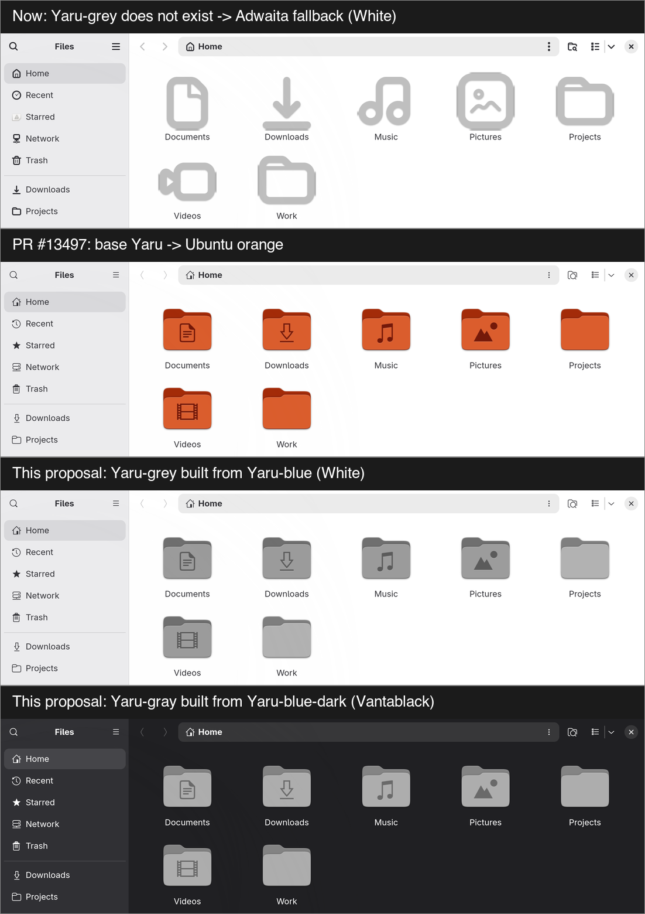

# Yaru grey for Omarchy

By **Seunghan** ([@seunghan91](https://github.com/seunghan91))

Omarchy's **White** theme sets the icon theme to `Yaru-grey` and **Vantablack**
sets `Yaru-gray`, but `yaru-icon-theme` ships no grey variant (only blue,
magenta, olive, prussiangreen, purple, red, sage, wartybrown, yellow and the
default orange). The name does not resolve, so GTK falls through to Adwaita's
flat outline icons — and, per [omacom/omarchy#7203](https://github.com/omacom/omarchy/issues/7203),
missing-icon placeholders and GTK4 crashes.

The intent for these two themes is monochrome ([#4872](https://github.com/omacom/omarchy/pull/4872)),
so swapping in a coloured Yaru variant ([#13497](https://github.com/omacom/omarchy/pull/13497))
changes the look. This script builds the missing grey variants from the
`yaru-icon-theme` package that is already installed:

| Variant | For | Built from |
|---|---|---|
| `Yaru-grey` | White (light) | `Yaru-blue`, colour removed, lightness ×1.15 |
| `Yaru-gray` | Vantablack (dark) | `Yaru-blue-dark`, colour removed |

Only the accent folder of each variant is rebuilt (about 260 files); everything
else is inherited from stock `Yaru`, the same way the coloured variants work.
It takes about a second.



## Use

```bash
sudo pacman -S --needed yaru-icon-theme imagemagick
./build-yaru-grey.sh                      # installs to ~/.local/share/icons
omarchy theme refresh                     # or re-apply White / Vantablack
```

To build into another location, for example for packaging:

```bash
./build-yaru-grey.sh /usr/share/icons "$pkgdir/usr/share/icons"
```

Remove: `rm -rf ~/.local/share/icons/Yaru-grey ~/.local/share/icons/Yaru-gray`

## Status

A proposal for [omacom/omarchy#7203](https://github.com/omacom/omarchy/issues/7203).
Tested on Omarchy 4.0.0.alpha (aarch64, Try Omarchy VM) with
`yaru-icon-theme 26.04.5.1ubuntu-1`: Nautilus shows grey folder icons in both
light and dark mode.

## License

The script is MIT (see [LICENSE](LICENSE)). The icons it produces are derived
from [Yaru](https://github.com/ubuntu/yaru) and stay under Yaru's license
(CC BY-SA 4.0).
